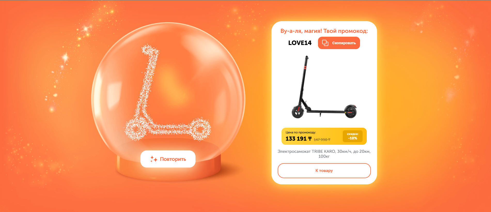

# 🎅 Neuro Santa



**Neuro Santa** — это новогодний интерактив для сайта [technodom.kz](https://technodom.kz), в котором пользователь "тряcёт" шар, и система генерирует **промокод на товары**.  
Особенностью проекта является визуализация категории подарка **внутри шара с помощью анимации частиц** (`react-particle-image`).

> Это специальный проект, созданный к **Новому году** для вовлечения пользователей в стиле новогоднего гадания 🎄✨

---

## 🔗 Ссылки 

- 💻 **Онлайн-доступ:** [neuro-santa](https://zaobaoo.github.io/neuro-santa/)
- 🎥 **Видео-демо:** [ссылка](https://zaobaoo.github.io/demo-pages/santa.html)

---

## 🚀 Основной функционал

- "Тряхни шар" — интерактивная анимация по нажатию
- Генерация **промокода**
- Отображение **категории товара в виде частиц**
- Эффекты появления, переходов и анимации

---

## 🛠️ Технологии

- **React**
- **Redux Toolkit** — стейт менеджер
- **Vite** — сборщик проекта
- **react-particle-image** — анимация изображения в частицах
- **react-motion-animate**, **react-transition-group** — анимации
- **react-intersection-observer** — обертка над Intersection Observer API для React
- **sass** — препроцессор

---

## 📦 Как запустить

```bash
# Установить зависимости
yarn install

# Запустить в режиме разработки
yarn dev

# Сборка для продакшена
yarn build

# Предпросмотр продакшена
yarn preview

# Деплой на GitHub Pages
yarn deploy
```

---

## 🖥️ Деплой

Проект развёрнут на **GitHub Pages** по адресу:

🔗 [https://zaobaoo.github.io/neuro-santa/](https://zaobaoo.github.io/neuro-santa/)

Для деплоя используется `gh-pages`:

```bash
yarn deploy
```

